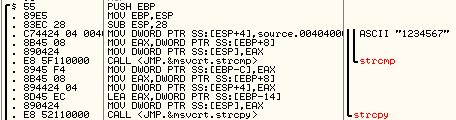

# Advances in Computer Science

> Spring Semester of sophomore year
>
> For PPTs, check out [here](./PPT)

## Project 1

[Project](https://github.com/LiuYuan-SHU/MyProjects/tree/main/3_Qt/Project1_encipherment)

## Project 2

### Environment

1. Microsoft Windows 10 Professional
2. [OllyDbg 1.10](https://www.ollydbg.de/)
3. gcc version 4.9.2 (tdm64-1)

### Questions

#### Q3 - Modify adjacency variables

##### Reference linking

1. [Introduction to Buffer Overflows in C++ (Heap & Stack Explained)](https://www.youtube.com/watch?v=tQb2yZDMrb0)
2. [Running a Buffer Overflow Attack - Computerphile](https://www.youtube.com/watch?v=1S0aBV-Waeo)
3. 《汇编语言（第四版） - 王爽》清华大学出版社

##### Idea

1. just read the assembly:

    

2. We can find there is a buffer length of 8 byte, and the total length of current stack is 28 byte, from the bottom to the top, items are:

    1. return ip, where is the returning address when the function ends, 4 Byte
    2. EBP, 4 Byte
    3. 
